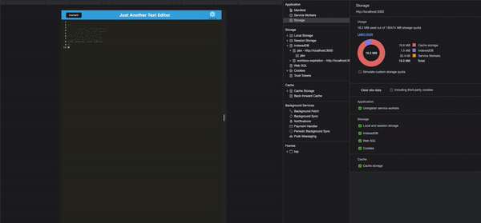

     

# 💬 Text Editor
---

## Table of Content 

* [Description](#description)
* [Technlogies](#technologies)
* [Installation](#installation)
* [Contributors](#contributors)
* [License](#license)
* [Contribution](#contribution)
* [Questions](#questions)

## 📝 Description
This is a single-page text-editor application that meets the PWA crietia. Additionally, it features a number of data presistence techniques that serve as redudancy in case one of the options is not supported by the browser and can also function offline. Using an existing application, I demonstrate my ability to implement methods for getting and storing data to an IndexedDB database. 

You can find the application [here](https://peaceful-hamlet-70308.herokuapp.com/)

## 🕹 Technologies used 
- JavaScript 
- nodejs
- Express 
- PWAs 
- indexedDB
- Heroku-app

## ⚙️ Installation 

1. Git clone this repository onto your local machine and navigate to the file on your terminal. *This can also be done by opening the file on Visual Studios and running it through the intergated terminal.*

2. Run `npm install` to download all the required dependencies

3. To start the application, run and then open your broswer to the listening port:

    - `npm run start`
    - `http://localhost:3000`

## 👥 Contributors

*[Raimee Abbassi](https://github.com/Raimeeab)*  
*The Univserity of Sydney | Trilogy Education Services*  

## 🔖 License

MIT License
Copyright (c) [2022] [Text Editor]
Permission is herby granted, free of charge, to any person obtaining a copy of this software and associated documentation files (the "Software"), to deal in the Software without restriction, including without limiation the rights to use, copy, modify, merge, publish, distribute, sublicense, and/or sell copies of the Software, and to permit persons to whom the Software is furnished to do so, subject following coditions: 
The above copyright notice and this permission notice shall be included in all copies or substantial portions of the Software. 

THE SOFTWARE IS PROVIDED "AS IS", WITHOUT WARRANTY OF ANY KIND, EXPRESS OR IMPLIED, INCLUDING BUT NOT LIMITED TO THE WARRANTIES OF MECHANTABILITY, FITNESS FOR A PARTICULAR PURPOSE AND NONINFRINGEMENT. IN NO EVENT SHALL THE AUTHORS OR COPYRIGHT HOLDERS BE LIABLE FOR ANY CLAIM, DAMAGES OR OTHER LIABILITY, WHETHER IN AN ACTION OF CONTRACT, TORT OR OTHERWISE, ARISING FROM, OUT OF OR IN CONNECTION WITH THE SOFTWARE OR THE USE OF OTHER DEALINGS IN THE SOFTWARE.  

---

## 🤝 How to Contribute

For information on how to contribute, please follow the guidlelines listed in [Contributor Covenant](https://www.contributor-covenant.org/).

## ❓ Questions
If you have any questions, contact me via [email](raimee.abbassi@gmail.com). You can also find more of my work [here](https://github.com/Raimeeab).

